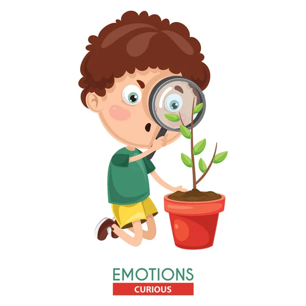

    
  <!-- Typing Effect -->

### _My Profile_
- Name: **Chew Chiu Xian**
- Age: **22**
- Hometown: [Kuala Krai, Kelantan](https://www.google.com/maps/place/Kuala+Krai,+Kelantan/@5.4296709,101.8549791,10z/data=!3m1!4b1!4m6!3m5!1s0x31b670a18abc418f:0xb744c535a768028f!8m2!3d5.530813!4d102.2018512!16zL20vMGZ0NXE4?entry=ttu)
- Birthday: **03/08/2004**
- Hobby: **Jogging, playing badminton**
- Ambition: **Data Scientist**
- Skill: **Coding with Java, C++, Python**
    

- Personalities: **Curious, patience and reliable**
   
  
  
  

- Soft Skills: **Team Collaboration, Problem-Solving, Time Management, Analytical Thinking, Communication, Team Leadership**

### 🎓 Education
- **Bachelor of Computer Science(Data Engineering), Year 3 Student**  ([The University of Technology Malaysia](https://www.utm.my/) )
- **Matriculation Student**  ([Kelantan Matriculation College](http://www.kmkt.matrik.edu.my/) )
- **Secondary School**  ([SMK Sultan Yahya Petra 1](https://www.facebook.com/SmkSultanYahyaPetra1yps/?locale=ms_MY) )

### 💼 Work Experience
>Trader (Secretariat Society in Kelantan Matriculation College)
  >- Improve accounting skills.
  >- Learn how to communicate with customer
  >- Practice teamworking with partner  

### 🏆 Achievements
* **4th Place in Cisco AI Hackathon 2024:** Awarded for presenting a winning idea that successfully addressed educational challenges by improving student motivation and learning interest. 
* **MCMC Datathon 2024:** Earned recognition in the datathon for creating an agricultural decision-support system that uses weather prediction to help farmers optimize planting and crop growth. 
* **Data Science Digital Race (DSDR):** Recognized for completing a data-driven competition that involved applying data analysis, problem-solving, and data structures & algorithms to solve real-world problems. 

### 💻 Featured Projects

### Kada Cooperative System 
- **Description:** Developed a cloud-based web application to solve problems about manual workflow processes on savings, loan applications, and document management. Designed and implemented key modules such as member registration, loan processing, and account management. 
- **Tech Stack:** PHP, MySQL, HTML, CSS, JavaScript
- **Github:** [KADA-System](https://github.com/cxchew/KADA-system)

### BioFlora 
- **Description:** Developed a blog platform for an concept idea for AI-driven web application to identify plant species or provide botanical data. 
- **Tech Stack:** Astro, HTML/CSS, MDX
- **Blog:** [BioFlora](https://bioflora.vercel.app/)

### Agriculture Crop Yield Prediction 
- **Description:** Develop a machine learning model using real-world agricultural data to predict the condition of the environment and growth of crops.
- **Tech Stack:** Canvas

 
 

**Connect with me:**

 

**Website of e-portfolio:**
- [E-portfolio](https://cxchew.github.io/)

 

